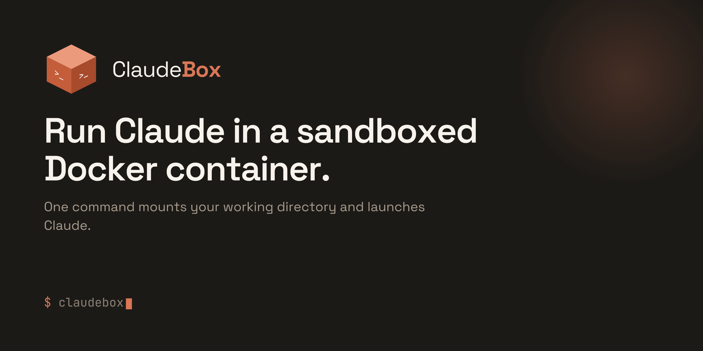

<p align="center">
  
</p>

# ClaudeBox

Run Claude Code in a sandboxed Docker container.

It works exactly the same as running `claude` locally — same interactive interface, same commands, same config. Your project directory is mounted in so Claude can read and edit your files, and your `~/.claude` config is shared so settings, memory, and auth persist between sessions.

By default the container is sandboxed: it can reach the public internet but **not your local network** (other machines, your router, cloud metadata endpoints), and it has **no access to Docker** unless you ask for it. This makes it a reasonable place to run Claude with `--dangerously-skip-permissions`. See [Sandboxing](#sandboxing).

> **Note (macOS):** If you use a Claude subscription (Pro/Max), your auth token lives in the macOS Keychain, which the container can't read directly. claudebox reads it and forwards it into the container automatically, so auth just works. If that ever fails (you'll see a warning), run `/login` once inside the container — the token is then saved to `~/.claude` and persists across sessions.

## Prerequisites

- [Docker](https://docs.docker.com/get-docker/) installed and running

## Setup

1. Clone the repo:

```bash
git clone https://github.com/youruser/claudebox.git
```

2. Add it to your PATH (pick one):

```bash
# bash
echo 'export PATH="$PATH:$HOME/claudebox"' >> ~/.bashrc
source ~/.bashrc

# zsh
echo 'export PATH="$PATH:$HOME/claudebox"' >> ~/.zshrc
source ~/.zshrc
```

Adjust the path if you cloned it somewhere other than `$HOME/claudebox`.

3. (Optional) Alias `claude` to `claudebox`:

```bash
# bash
echo 'alias claude="claudebox"' >> ~/.bashrc
source ~/.bashrc

# zsh
echo 'alias claude="claudebox"' >> ~/.zshrc
source ~/.zshrc
```

## Usage

```bash
# Just run it — the Docker image builds automatically on first launch
claudebox
```

All arguments are passed through to Claude Code:

```bash
claudebox --resume
claudebox --print "explain this repo"
claudebox --model sonnet
```

### Port forwarding

Expose ports from the container to your machine (useful when Claude spins up a dev server):

```bash
claudebox -p 3000:3000
claudebox -p 3000:3000 -p 8080:8080
```

### SSH agent forwarding

Forward your local SSH agent into the container for git operations over SSH:

```bash
claudebox --ssh
```

### Custom builds

Rebuild the image at any time:

```bash
claudebox --build
```

Only include specific languages to keep the image smaller:

```bash
claudebox --build --with go,python
claudebox --build --with rust
```

Available tools: `go`, `python`, `rust`. All are included by default.

Node.js and npm are always included as they are required by Claude Code.

### Combining flags

Claudebox flags and Claude flags can be mixed freely:

```bash
claudebox --ssh -p 3000:3000 --docker --resume
```

## Flags

| Flag | Description |
|------|-------------|
| `--docker` | Start an isolated rootless Docker daemon inside the container (safe; host Docker untouched) |
| `--host-docker` | Mount the host Docker socket — grants host-root power and escapes the sandbox; use only when you need the host's daemon |
| `--allow-lan` | Allow the container to reach your local network (the LAN firewall is on by default) |
| `--ssh` | Forward your local SSH agent into the container for git over SSH |
| `-p`, `--port <host:container>` | Publish a container port to your host (repeatable) |
| `--build` | (Re)build the image before launching |
| `--with <list>` | With `--build`, include only these optional languages: `go`, `python`, `rust` |
| `--help`, `-h` | Show usage and exit |

Any other arguments are passed straight through to Claude Code (e.g. `--resume`, `--model`, `--print`, `--dangerously-skip-permissions`).

## Sandboxing

claudebox is built to run Claude — including in `--dangerously-skip-permissions` mode — without giving it a path to your local network or host machine.

### Network isolation

By default, egress to private/LAN ranges (`10/8`, `172.16/12`, `192.168/16`, `169.254/16`) is dropped inside the container, so Claude can reach the public internet but not other machines on your network, your router's admin page, or cloud metadata endpoints. DNS still works (the container's own resolvers are allowlisted).

The firewall is installed by the container's entrypoint, which then drops the `CAP_NET_ADMIN` capability before launching Claude — so Claude itself cannot flush or alter the rules, even running as root.

Allow LAN access if you actually need it (e.g. hitting a service on your host):

```bash
claudebox --allow-lan
```

### Docker access

Claude has no access to Docker unless you opt in. Two modes:

```bash
# Isolated, rootless Docker daemon inside the container. Safe: it has its own
# image cache and containers, can't see or touch your host's Docker, and a
# breakout from a nested container lands in the sandbox, not on your host.
claudebox --docker

# Mount the host's Docker socket. DANGEROUS: this is effectively root on your
# host — it lets the container escape the sandbox and bypass the LAN firewall.
# Only use it when you specifically need the host's daemon (e.g. pushing to a
# local registry or driving the host's Kubernetes) and trust the session.
claudebox --host-docker
```

`--docker` is the right choice for most "Claude needs to build/run a container" tasks. Reach for `--host-docker` only when the work genuinely targets the host's Docker.

## What's in the box

The base image always includes:

- **Node.js** 24 + npm (required by Claude Code)
- **Git**, git-lfs, ssh
- **Build tools** (gcc, cmake, pkg-config)
- **Search tools** (ripgrep, fd, jq)
- **Claude Code CLI**
- **Deno**
- **Rootless Docker** (daemon + CLI, started on demand with `--docker`)

Optional (included by default, configurable with `--with`):

- **Go** 1.24
- **Python** 3 + pip + venv
- **Rust** (stable via rustup)
